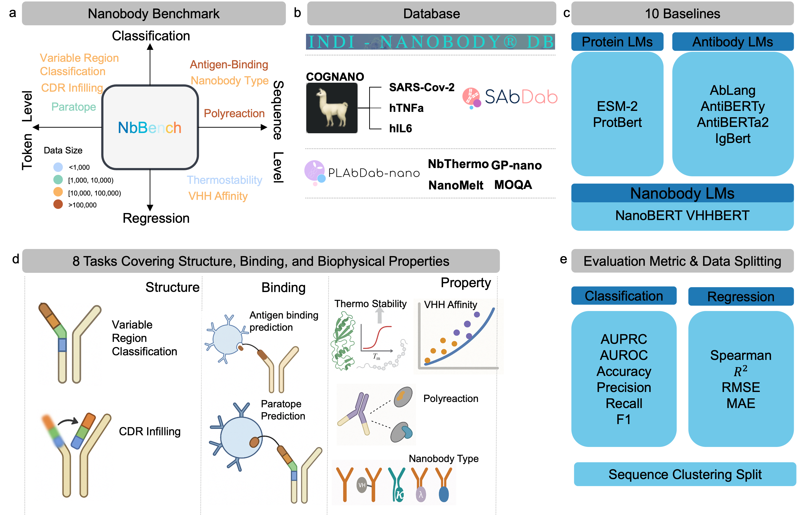

# NanobodyBenchmark: A Benchmark Platform for Single-Domain Antibody Language Models

This is the official repository for NanobodyBenchmark, designed to evaluate and compare various pre-trained language models for single-domain antibodies on downstream tasks.

<p align="center">
    
</p>


## Prerequisites

### Installation

Key dependencies: torch==1.13.1+cu117, transformers==4.38.1

```bash
git clone https://github.com/ZHymLumine/NbBench.git
cd NbBench
conda create -n nbbench python=3.8 -y
pip install -r requirements.txt
```

## 🔍 Tasks and Datasets

### Data Structure

```
NanobodyBenchmark
├── checkpoint
│   └── opensource
│       ├── esm2
│       ├── protbert
│       ├── ablang_l
│       ├── ablang_h
│       ├── antiberta2
│       ├── vhhbert
│       ├── igbert
│       ├── iglm
│       ├── antiberty
│       └── nanobert
├── data_utils
│   ├── Data processing tools
│   └── Clustering results
├── downstream
│    ├── train_cdr_classification.py
│    ├── train_interaction.py
│    ├── train_sdab_type.py
│    ├── train_cdr_infilling.py
│    ├── train_paratope.py
│    ├── train_vhh_affinity.py
│    ├── train_thermo.py
│    └── train_polyreaction.py
├── model
│   ├── esm2
│   ├── protbert
│   ├── ablang_l
│   ├── ablang_h
│   ├── antiberta2
│   ├── vhhbert
│   ├── igbert
│   ├── antiberty
│   └── nanobert
├── tokenizer
└── scripts
    └── opensource
```

Current supported downstream tasks:

- `Nanobody (single-domain antibody) type classification` (VHH, VNAR, etc.)
- `Variable region classification`
- `CDR region infilling`
- `Paratope prediction`
- `Affinity prediction`
- `Thermostability prediction`
- `Polyreactivity prediction`
- `Antigen-antibody interaction prediction`

## 🔍 Models

<p align="center">
    
</p>

Currently supported pre-trained models:

- `ESM2`
- `ProtBERT`
- `AblangL`
- `AblangH`
- `AntiBERTa2`
- `VHHBert`
- `IgBERT`
- `AnTiberty`
- `NanoBERT`

### Model Settings

| Model                                               | Name         | Architecture | Max Seq Length | Parameters |
| -------------------------------------------------- | ------------ | ---------- | ------------ | ------ |
| [ESM2](https://github.com/facebookresearch/esm)    | esm2         | Transformer| 1024         | 650M   |
| [ProtBERT](https://github.com/agemagician/ProtTrans)| protbert    | BERT       | 512          | 420M   |
| [AblangL](https://github.com/oxpig/AbLang)         | ablang_l     | BERT       | 512          | 85M    |
| [AblangH](https://github.com/oxpig/AbLang)         | ablang_h     | BERT       | 512          | 85M    |
| [AntiBERTa2](https://github.com/aronwalsh/AntiBERTa2)| antiberta2 | RoBERTa    | 512          | 86M    |
| [VHHBert](https://github.com/hefeda/VHHbert)       | vhhbert      | BERT       | 512          | 86M    |
| [IgBERT](https://github.com/Graylab/IgBERT)        | igbert       | BERT       | 512          | 110M   |
| [AnTiberty](https://github.com/ShanGaoLUMC/antiberty)| antiberty  | BERT       | 512          | 86M    |
| [NanoBERT](https://github.com/YOUR_USERNAME/NanobodyBenchmark)| nanobert | BERT | 512       | 110M   |

## 🔍 How to Use

### Fine-tuning

To evaluate models on all nanobody tasks, run the bash scripts in the `scripts` folder:

```bash
cd NbBench
bash ./scripts/opensource/{model_name}/all_tasks.sh
```

### Computing Embeddings

Here's how to get embeddings from a sample single-domain antibody sequence:

```python
import os, sys
current_path = os.path.dirname(os.path.abspath(__file__))
parent_dir = os.path.dirname(current_path)
sys.path.append(parent_dir)
from model.esm2.modeling_esm import EsmModel
from tokenizer.tokenization_esm import EsmTokenizer

tokenizer = EsmTokenizer.from_pretrained('./checkpoint/opensource/esm2', model_max_length=1024, padding_side="right", use_fast=True)
model = EsmModel.from_pretrained('./checkpoint/opensource/esm2')
sequences = ["QVQLQESGGGLVQAGGSLRLSCAASGSIFSINTMGWYRQAPGKQRELVAAITSGGSTNYRDSVKGRFTISRDNAKNTVYLQMNSLKPEDTAVYYCNAGYGGSYYYPSSDVLEYWGQGTQVTVSS"]
output = tokenizer.batch_encode_plus(sequences, return_tensors="pt", padding="longest", max_length = 1024, truncation=True)
input_ids = output["input_ids"]
attention_mask = output["attention_mask"]

embedding = model(input_ids=input_ids, attention_mask=attention_mask)[0] # shape [bz, length, hidden_size]
print(embedding.shape)
```

## License

This repository is released under the Apache License 2.0, as detailed in the [LICENSE](LICENSE) file.

## Citation

If you use this repository in your research, please consider citing our paper:

```
@misc{zhang2024nanobodybenchmark,
      title={NanobodyBenchmark: Comprehensive Benchmark for Single-Domain Antibody Language Models},
      author={Your Name and Co-authors},
      year={2024},
      howpublished={GitHub: https://github.com/YOUR_USERNAME/NanobodyBenchmark}
}
```
