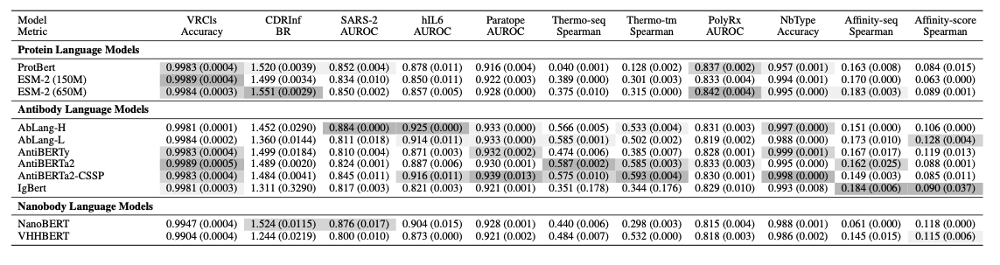

# NanobodyBenchmark: A Benchmark Platform for Single-Domain Antibody Language Models

This is the official repository for NanobodyBenchmark, designed to evaluate and compare various pre-trained language models for single-domain antibodies on downstream tasks.

<p align="center">
    
</p>


## Prerequisites

### Installation

Key dependencies: torch==1.13.1+cu117, transformers==4.38.1

```bash
git clone https://github.com/ZHymLumine/NbBench.git
cd NbBench
conda create -n nbbench python=3.8 -y
pip install -r requirements.txt
```

### Downloading Pre-trained Model Weights

We evaluate multiple open-source pre-trained models. Download these model weights to the corresponding `checkpoint/opensource/{model_name}` directory.

Supported models and their Hugging Face repository URLs:
[ZYMScott/nanobody-antigen-binding](https://huggingface.co/datasets/ZYMScott/nanobody-antigen-binding)
| Model Name   | Hugging Face Repository |
|--------------|-------------------------|
| ESM2-150M         | [facebook/esm2_t30_150M_UR50D](https://huggingface.co/facebook/esm2_t30_150M_UR50D) |
| ESM2-650M         | [facebook/esm2_t33_650M_UR50D](https://huggingface.co/facebook/esm2_t33_650M_UR50D) |
| ProtBERT     | [Rostlab/prot_bert](https://huggingface.co/Rostlab/prot_bert) |
| AblangL      | [qilowoq/AbLang_heavy](https://huggingface.co/qilowoq/AbLang_heavy) |
| AblangH      | [qilowoq/AbLang_light](https://huggingface.co/qilowoq/AbLang_light) |
| AnTiberty    | [ZYMScott/antiberty](https://huggingface.co/ZYMScott/antiberty)  or from [PyPI weights](https://pypi.org/project/antiberty/#files) |
| AntiBERTa2   | [alchemab/antiberta2](https://huggingface.co/alchemab/antiberta2) |
| AntiBERTa2-cssp   | [alchemab/antiberta2-cssp](https://huggingface.co/alchemab/antiberta2-cssp) |
| IgBERT       | [Exscientia/IgBert](https://huggingface.co/Exscientia/IgBert) |
| NanoBERT     | [NaturalAntibody/nanoBERT](https://huggingface.co/NaturalAntibody/nanoBERT) |
| VHHBert      | [COGNANO/VHHBERT](https://huggingface.co/COGNANO/VHHBERT) |

## 🔍 Tasks and Datasets

### Data Structure

```
NanobodyBenchmark
├── checkpoint
│   └── opensource
│       ├── esm2
│       ├── protbert
│       ├── ablang_l
│       ├── ablang_h
│       ├── antiberta2
│       ├── vhhbert
│       ├── igbert
│       ├── iglm
│       ├── antiberty
│       └── nanobert
├── data_utils
│   ├── Data processing tools
│   └── Clustering results
├── downstream
│    ├── train_cdr_classification.py
│    ├── train_interaction.py
│    ├── train_sdab_type.py
│    ├── train_cdr_infilling.py
│    ├── train_paratope.py
│    ├── train_vhh_affinity.py
│    ├── train_thermo.py
│    └── train_polyreaction.py
├── model
│   ├── esm2
│   ├── protbert
│   ├── ablang_l
│   ├── ablang_h
│   ├── antiberta2
│   ├── vhhbert
│   ├── igbert
│   ├── antiberty
│   └── nanobert
├── tokenizer
└── scripts
    └── opensource
```

Current supported downstream tasks:

- `Nanobody (single-domain antibody) type classification` (VHH, VNAR, etc.)
- `Variable region classification`
- `CDR region infilling`
- `Paratope prediction`
- `Affinity prediction`
- `Thermostability prediction`
- `Polyreactivity prediction`
- `Antigen-antibody interaction prediction`

### Using Hugging Face Datasets

NanobodyBenchmark now supports loading datasets directly from Hugging Face Dataset Hub or downloading them to local storage. This provides flexibility and easier access to benchmark datasets.

#### Available Datasets on Hugging Face

The following datasets are available on [Hugging Face collection](https://huggingface.co/collections/ZYMScott/nbbench-68141e3051f8723e48cd585d):


- **Binding Prediction**: 
    - [SARS-COV-2](https://huggingface.co/datasets/ZYMScott/SARS-CoV-2)
    - [hIL6](https://huggingface.co/datasets/ZYMScott/hIL6)
    - [paratope prediction](https://huggingface.co/datasets/ZYMScott/Paratope)
- **[VR Classification](https://huggingface.co/datasets/ZYMScott/VRClassification)**
- **[CDR Infilling](https://huggingface.co/datasets/ZYMScott/CDRInfilling)**
- **Thermostability**: 
    - [thermo-seq](https://huggingface.co/datasets/ZYMScott/thermo-seq)
    - [thermo-tm](https://huggingface.co/datasets/ZYMScott/thermo-tm)
- **Affinity**: 
    - [affinity-seq](https://huggingface.co/datasets/ZYMScott/vhh_affinity-seq)
    - [affinity-score](https://huggingface.co/datasets/ZYMScott/vhh_affinity-score)   
- **[Polyreactivity](https://huggingface.co/datasets/ZYMScott/polyreaction)**
- **[Nanobody type](https://huggingface.co/datasets/ZYMScott/nanobody_type)**


#### Loading Datasets

You can load datasets from Hugging Face in three ways:

1. **Direct Loading** - Use the dataset from Hugging Face without downloading:


2. **Download to Local Path** - Download the dataset to your local `data/downstream` directory.

#### Special Note for Antigen-Antibody Interaction Task

For the interaction prediction task, the model requires antigen embeddings. These embeddings are automatically downloaded from the Hugging Face dataset repository. No additional steps are needed.

## 🔍 Models

<p align="center">
    
</p>

Currently supported pre-trained models:

- `ESM2`
- `ProtBERT`
- `AblangL`
- `AblangH`
- `AntiBERTa2`
- `VHHBert`
- `IgBERT`
- `AnTiberty`
- `NanoBERT`

## 🔍 How to Use

### Fine-tuning

To evaluate models on all nanobody tasks, run the bash scripts in the `scripts` folder:

```bash
cd NbBench
bash ./scripts/opensource/{model_name}/all_tasks.sh
```

### Computing Embeddings

Here's how to get embeddings from a sample single-domain antibody sequence:

```python
import torch
from transformers import EsmModel, EsmTokenizer
from tqdm import tqdm
import pandas as pd

model_name = "facebook/esm2_t33_650M_UR50D"
tokenizer = EsmTokenizer.from_pretrained(model_name)
model = EsmModel.from_pretrained(model_name)
model.eval().cuda()

def get_unique_sequences(csv_files):
    sequences = set()
    for file in csv_files:
        df = pd.read_csv(file)
        sequences.update(df["seq"].dropna().unique())
    return list(sequences)


def get_embedding(sequence, max_seq_length):
    inputs = tokenizer(sequence, padding="max_length", return_tensors="pt", truncation=True, max_length=max_seq_length)
    with torch.no_grad():
        outputs = model(**{k: v.cuda() for k, v in inputs.items()})
    last_hidden_state = outputs.last_hidden_state.cpu()
    return last_hidden_state  # shape: [hidden_size]


def save_embeddings_pt(sequences, output_path):
    max_seq_length = max(len(seq) for seq in sequences)
    emb_dict = {}
    for seq in sequences:
        emb = get_embedding(seq, max_seq_length)
        emb_dict[seq] = emb
    torch.save(emb_dict, output_path)
    print(f"Saved {len(emb_dict)} embeddings to {output_path}")

csv_files = ["train.csv", "val.csv", "test.csv"]
sequences = get_unique_sequences(csv_files)

save_embeddings_pt(sequences, "antigen_embeddings.pt")
```
or you can download the precomputed `antigen_embeddings.pt` file from huggingface 
- [SARS-CoV-2](https://huggingface.co/datasets/ZYMScott/SARS-CoV-2/tree/main)
- [hIL6](https://huggingface.co/datasets/ZYMScott/hIL6/tree/main)
- [Paratope](https://huggingface.co/datasets/ZYMScott/Paratope/tree/main)

## License

This repository is released under the Apache License 2.0, as detailed in the [LICENSE](LICENSE) file.

## Citation

If you use this repository in your research, please consider citing our paper:

```
@misc{zhang2025nbbenchbenchmarkinglanguagemodels,
      title={NbBench: Benchmarking Language Models for Comprehensive Nanobody Tasks}, 
      author={Yiming Zhang and Koji Tsuda},
      year={2025},
      eprint={2505.02022},
      archivePrefix={arXiv},
      primaryClass={cs.LG},
      url={https://arxiv.org/abs/2505.02022}, 
}
```
